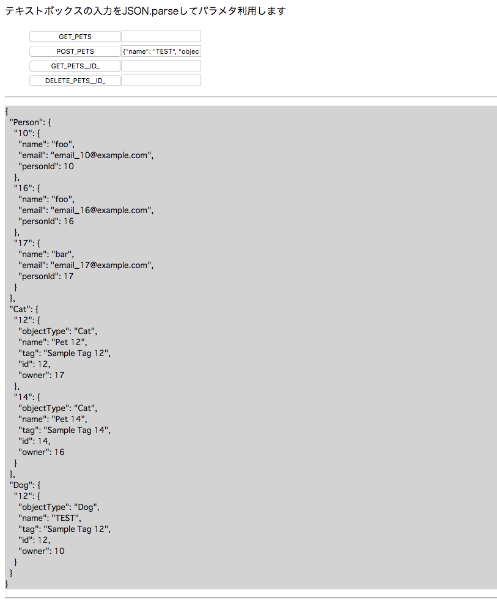

# Example

## 概要
- ここでは以下のYAMLファイルに基づいたコードの自動生成と簡単な動作確認ができます。
- YAMLに基づいたスキーマが定義され、モックサーバのレスポンスに応じた正規化が実行されます。

## 使い方
1. API定義確認  
    ```bash
    % yarn serve
    % open http://localhost:3000/viewer
    ```
1. コード自動生成
    ```bash
    % yarn build:sample:models examples/petstore.v3.yml 
    % yarn build:sample:schemas examples/petstore.v3.yml 
    ```
    
    以下のようなファイル群が生成されます。
    ```bash
    examples/tmp/
    ├── actions
    │   └── actionTypes.js
    ├── models
    │   ├── _cat.js
    │   ├── _company.js
    │   ├── _dog.js
    │   ├── _person.js
    │   ├── _pet.js
    │   ├── cat.js
    │   ├── company.js
    │   ├── dog.js
    │   ├── index.js
    │   ├── person.js
    │   └── pet.js
    ├── schemas
    │   └── sample_schema.js
    └── sample_api.js

    ```
1. 動作確認  
    1. 確認用サンプルビルド  
      ```bash
      % yarn build:sample
      ```
    1. モックサーバ起動  
      ```bash
      % yarn mock
      ```
    1. サンプル表示  
      ```bash
      % open http://localhost:3000
      ```
    1. 動作確認
       - developer toolsで通信内容確認
       - ブラウザ画面で正規化データ表示確認  
         
       

